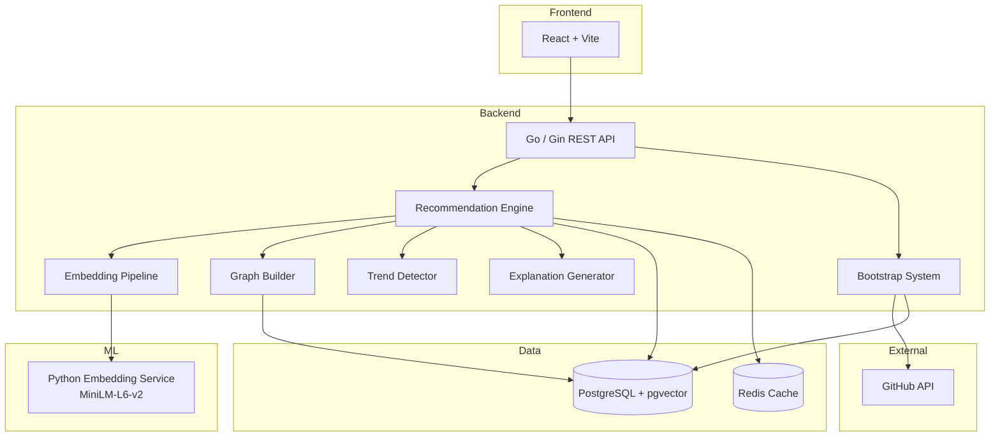
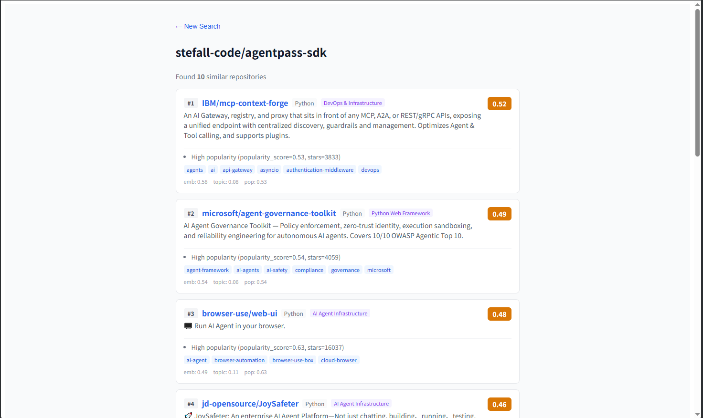

# GitSense

GitSense is a GitHub Ecosystem Discovery Engine that combines embeddings, graph analysis, trend detection and explainable ranking to help developers discover relevant open-source projects.

## Features

- **Repository Recommendation** — Input any GitHub repo, get top-10 similar projects with scores and reasons
- **Embedding Search** — Semantic search powered by MiniLM (384-dim) with pgvector
- **Topic Graph** — Topic co-occurrence network with 6,000+ edges connecting 14,000+ topics
- **Ecosystem Discovery** — Auto-classified tech ecosystems (AI Agent, Database, Web Framework, etc.)
- **Trend Detection** — Growth rate analysis using 7-day windows with Laplace smoothing
- **Explainable Recommendations** — Every result includes score breakdown and human-readable reasons
- **Bootstrap Dataset** — BFS-based data collection from awesome-lists with quality filtering (5,900+ repos)
- **React Frontend** — Search + Result pages with real-time recommendations
- **Docker Deployment** — One-command setup with Docker Compose

## Architecture



## Tech Stack

| Layer | Technology |
|-------|-----------|
| **Backend** | Go 1.24, Gin, PostgreSQL, pgvector, Redis |
| **ML** | Python, FastAPI, sentence-transformers (MiniLM-L6-v2) |
| **Frontend** | React, TypeScript, Vite |
| **Deployment** | Docker, Docker Compose |

## Quick Start

### Prerequisites

- Docker & Docker Compose
- (Optional) GitHub Personal Access Token for higher API rate limits

### 1. Clone & Configure

```bash
git clone https://github.com/stefall-code/gitsense.git
cd gitsense
cp .env.example .env
# Edit .env and set your GITHUB_TOKEN (optional but recommended)
```

### 2. Start Services

```bash
docker compose up -d
```

This starts 4 containers:
- **postgres** — PostgreSQL 16 + pgvector
- **redis** — Redis 7 cache
- **embedding-service** — Python MiniLM embedding service
- **backend** — Go API server

### 3. Seed Initial Data

```bash
# Seed a single repo to verify the pipeline
curl -X POST http://localhost:8080/admin/seed \
  -H "Authorization: Bearer YOUR_ADMIN_TOKEN" \
  -H "Content-Type: application/json" \
  -d '{"repos":["langchain-ai/langgraph"]}'
```

### 4. Get Recommendations

```bash
curl http://localhost:8080/api/v1/repos/langchain-ai/langgraph/recommendations
```

### 5. Bootstrap Larger Dataset

```bash
curl -X POST http://localhost:8080/admin/bootstrap/start \
  -H "Authorization: Bearer YOUR_ADMIN_TOKEN"
```

### 6. Open Frontend

```
http://localhost:5173
```

## API Overview

| Endpoint | Method | Description |
|----------|--------|-------------|
| `/api/v1/repos/:owner/:repo/recommendations` | GET | Get similar repos with scores & reasons |
| `/api/v1/search?q=keyword` | GET | Semantic search across repos |
| `/api/v1/ecosystems` | GET | List all tech ecosystems |
| `/api/v1/trends/topics` | GET | Trending topics |
| `/admin/seed` | POST | Seed specific repos |
| `/admin/bootstrap/start` | POST | Start dataset bootstrap |
| `/admin/build-graph` | POST | Rebuild graph structure |
| `/admin/graph/metrics` | GET | Graph health metrics |
| `/admin/audit/graph` | GET | Full graph audit report |

All `/admin/*` endpoints require `Authorization: Bearer <ADMIN_TOKEN>` header.

## Screenshots



## Project Structure

```
gitsense/
├── backend/
│   ├── cmd/server/          # Entry point
│   ├── internal/
│   │   ├── bootstrap/       # Dataset collection (BFS + awesome-lists)
│   │   ├── config/          # Environment configuration
│   │   ├── ecosystem/       # Ecosystem classification rules
│   │   ├── embedding/       # Embedding provider interface
│   │   ├── graph/           # Graph builder, store, service
│   │   ├── handler/         # HTTP handlers
│   │   ├── middleware/      # Admin auth middleware
│   │   ├── model/           # Data models
│   │   ├── repository/      # Repo data access
│   │   ├── router/          # Route registration
│   │   ├── search/          # Search service
│   │   ├── service/         # Core recommendation logic
│   │   └── trend/           # Trend detection
│   ├── migrations/          # SQL migration scripts
│   └── Dockerfile
├── frontend/
│   ├── src/
│   │   ├── pages/           # Search & Result pages
│   │   ├── components/      # RepoCard, etc.
│   │   └── api/             # API client
│   └── Dockerfile
├── embedding-service/
│   ├── main.py              # FastAPI embedding service
│   ├── Dockerfile
│   └── requirements.txt
├── docker-compose.yml
├── .env.example
└── README.md
```

## Roadmap

- [ ] Graph quality improvement (higher coverage, larger connected components)
- [ ] Online demo deployment
- [ ] Ecosystem visualization (interactive graph UI)
- [ ] Ranking optimization (embedding model upgrade)
- [ ] User authentication & favorites
- [ ] API rate limiting for public access

## License

MIT License

Copyright (c) 2025 GitSense
